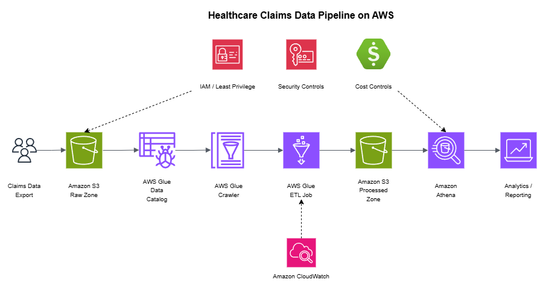

# Healthcare Claims Data Pipeline on AWS

## Overview

This project presents an AWS data pipeline architecture for healthcare claims analytics. The design focuses on secure data ingestion, centralized storage, schema discovery, SQL-based analysis, monitoring, and cost-aware data processing.

The goal is to demonstrate how healthcare claims data could move from raw intake to queryable analytics while maintaining security, operational visibility, and practical cost controls.

This is an architecture-focused portfolio project using sample or synthetic claims data only. No real patient, member, provider, or payment data is included.

## Architecture Diagram

## Architecture Goal

The architecture is designed to support a healthcare operations use case where claims or payment-related data must be collected, validated, stored, queried, and reviewed for reporting or operational analysis.

Key goals:

- Store raw claims data securely
- Separate raw, processed, and queryable data zones
- Use AWS-native services for cataloging and SQL analysis
- Support monitoring and operational visibility
- Apply encryption and least-privilege access controls
- Document cost, security, and design tradeoffs

## Planned Architecture

The design will use:

- Amazon S3 for raw, processed, and analytics data zones
- AWS Glue Data Catalog for schema discovery and metadata management
- AWS Glue crawler or ETL job for data preparation
- Amazon Athena for SQL-based analysis
- Amazon CloudWatch for monitoring and operational visibility
- AWS IAM for least-privilege access control
- AWS KMS or S3-managed encryption for data protection
- AWS Cost Explorer or Pricing Calculator for cost-awareness

## Data Flow

1. Claims data is uploaded into a raw S3 bucket or raw data prefix.
2. AWS Glue crawls the raw data and updates the Data Catalog.
3. Data is cleaned, transformed, or partitioned into a processed S3 location.
4. Athena queries the cataloged data for reporting and analysis.
5. CloudWatch monitors pipeline activity, errors, and operational signals.
6. Cost and storage decisions are reviewed for optimization opportunities.

## Example Use Cases

This architecture could support:

- Claims volume reporting
- Payment exception tracking
- Reissue or reversal analysis
- Provider payment workflow analysis
- Operational dashboard source data
- Cost-aware healthcare analytics workflows

## Security Considerations

- Use synthetic or de-identified data only
- Encrypt S3 data at rest
- Restrict S3 bucket access with least-privilege IAM policies
- Separate raw and processed data zones
- Avoid public bucket access
- Log access and operational activity where appropriate
- Limit Athena and Glue permissions by role

## Monitoring and Operations

Operational visibility should include:

- Glue crawler or job success and failure status
- Athena query failures or abnormal usage
- S3 object activity and access patterns
- CloudWatch alarms for job errors
- Cost monitoring for Athena scans and S3 storage growth

## Cost Considerations

Cost-aware design decisions include:

- Use compressed and columnar formats where appropriate
- Partition data to reduce Athena scan costs
- Separate raw and processed storage
- Apply S3 lifecycle policies for older data
- Monitor Glue job runtime and Athena query volume
- Avoid unnecessary always-on compute resources

## Tradeoff Analysis

### Benefits

- Serverless analytics design with minimal infrastructure management
- S3 provides durable and scalable storage
- Athena supports SQL analysis without managing database servers
- Glue Data Catalog improves discoverability and schema management
- Separation of raw and processed zones improves governance

### Tradeoffs

- Athena costs can increase if data is not partitioned or compressed
- Glue jobs require proper configuration and monitoring
- S3 data organization must be designed carefully
- This approach is strong for analytics, but not ideal for low-latency transactional workloads

## Repository Structure

- `diagrams_architecture.png` - Architecture diagram for the AWS claims data pipeline
- `sample-data` - Synthetic claims sample data
- `sql/athena_queries.sql` - Athena SQL query examples
- `docs/design-notes.md` - Design notes and architecture decision support
- `README.md` - Project overview and documentation

## Future Enhancements

Future enhancements could include:

- Cost estimate comparison
- CloudWatch monitoring plan
- Glue crawler configuration notes
- Data partitioning strategy
- Optional Power BI dashboard mockup
- Optional Parquet conversion example

## Interview Explanation

This project demonstrates how I think through healthcare data movement and analytics on AWS. The design uses S3 for durable storage, Glue for cataloging and preparation, Athena for SQL analysis, and CloudWatch for operational visibility. The main tradeoff is balancing a simple serverless analytics design with the need for strong data organization, access controls, monitoring, and cost management.

## Author

Otis Joseph  
AWS Certified Solutions Architect - Associate  
AWS Certified Cloud Practitioner  
AWS Certified AI Practitioner
